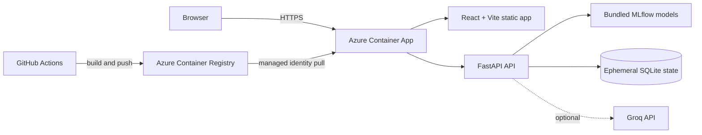

# EcoForecaster

[](https://github.com/YassirCher/Energy-Consumption-AI-Forecaster/actions/workflows/ci-cd.yml)


EcoForecaster is a full-stack energy-consumption forecasting and MLOps observability platform. It combines multi-horizon LightGBM models, drift and anomaly monitoring, SHAP explanations, scenario simulation, JWT-based roles, and optional Groq-powered AI analysis in one responsive dashboard.

**Live application:** [ca-ecoforecaster.prouddune-d60d19a6.spaincentral.azurecontainerapps.io](https://ca-ecoforecaster.prouddune-d60d19a6.spaincentral.azurecontainerapps.io)

Production credentials and API keys are intentionally not published. Contact the repository owner for authorized demo access.

## Highlights

- Current, one-hour, and 24-hour energy forecasts from bundled production models
- Live system health, latency, model metrics, alerts, and Server-Sent Events
- Jensen-Shannon drift detection and hybrid Isolation Forest/Z-score anomaly detection
- Global and local SHAP explanations, feature evolution, and model comparison
- Scenario simulation, reports, CSV exports, and A/B-test views
- Optional Graph RAG, specialist AI agents, and Groq-backed explanations
- Admin/viewer roles with protected administrative and AI operations
- Immutable Docker images and automated Azure Container Apps deployment

## Architecture



The production image is a multi-stage build. Node.js compiles the frontend, then a Python runtime serves the built assets and FastAPI from the same origin on port `8000`.

## Technology

| Layer | Main components |
| --- | --- |
| Frontend | React 19, Vite 8, Axios, Recharts, Lucide React |
| API | Python 3.11, FastAPI, Uvicorn, Pydantic |
| ML/MLOps | LightGBM, XGBoost, scikit-learn, MLflow, SHAP |
| AI | Groq API, Graph RAG, specialist analysis agents |
| Delivery | Docker, GitHub Actions, Azure Container Registry, Azure Container Apps |

## Quick start

### Prerequisites

- Python 3.11
- Node.js 22 and npm
- Git

### Backend

```powershell
python -m venv .venv
.\.venv\Scripts\Activate.ps1
pip install -r backend/requirements-runtime.txt pytest
Set-Location backend
uvicorn src.api.main:app --reload --port 8000
```

Local development seeds `admin/admin123` and `viewer/viewer123` only when the local users database is empty. Those defaults are blocked as implicit production configuration; production must inject its own secret values.

### Frontend

In a second terminal:

```powershell
Set-Location frontend
npm ci
npm run dev
```

Open `http://localhost:5173`. The development frontend connects to `http://localhost:8000` by default. Set `VITE_API_BASE_URL` during the frontend build when using a separate API origin.

### Optional AI configuration

Set `GROQ_API_KEY` in the process environment to enable LLM-backed features. Never commit an API key or a populated `.env` file. See [.env.example](.env.example) for the supported settings.

## Quality checks

```powershell
Set-Location backend
pytest -q

Set-Location ..\frontend
npm ci
npm run lint
npm run build
```

Every pull request and push to `main` runs the same backend tests, frontend lint, and production build. Pushes to `main` also deploy an immutable commit-tagged image and run live health, prediction, and frontend smoke tests.

## Repository layout

```text
.
├── backend/                  FastAPI, ML services, tests, and bundled models
├── frontend/                 React/Vite dashboard
├── infra/container-app.json Azure Container Apps ARM template
├── notebooks/                EDA and model-development notebooks
├── .github/workflows/        CI/CD automation
├── Dockerfile                Multi-stage production image
├── app.md                    Product and runtime reference
└── deployment.md             Azure deployment and operations guide
```

## Documentation

- [Application reference](app.md)
- [Deployment and operations](deployment.md)
- [Security policy](SECURITY.md)
- Interactive API documentation is available at `/docs` on a running instance.

## Security and responsible use

- Production secrets live in Azure Container Apps secret references, never in source control.
- GitHub Actions authenticates to Azure through OpenID Connect; no long-lived Azure password is stored in the workflow.
- Administrative model actions require the `admin` role, and AI-backed endpoints require authentication.
- Forecasts and AI explanations are decision-support outputs, not guarantees. Validate them before operational, financial, or safety-critical use.

See [SECURITY.md](SECURITY.md) for vulnerability reporting. No software license has been selected yet; public visibility alone does not grant reuse rights.
