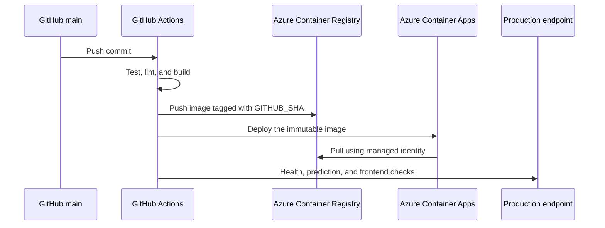

# Deployment and operations

This guide documents the production path from GitHub to Azure Container Apps. The repository deploys one immutable image per commit to `main` and verifies the resulting revision before the workflow succeeds.

## Production topology



The current configuration uses HTTPS-only ingress, a single active revision, one CPU, 2 GiB of memory, and scale-to-zero with a maximum of one replica.

## CI/CD behavior

The workflow is defined in [`.github/workflows/ci-cd.yml`](.github/workflows/ci-cd.yml).

| Trigger | Validation | Deployment |
| --- | --- | --- |
| Pull request to `main` | Yes | No |
| Push to `main` | Yes | Yes |
| Manual dispatch | Yes | Yes |

The validation job installs pinned Python runtime dependencies, runs `pytest`, performs a clean `npm ci`, lints the frontend, and builds the production bundle.

The deployment job:

1. Validates all required repository variables.
2. Authenticates to Azure with GitHub OpenID Connect.
3. Builds and pushes `<registry>/ecoforecaster:<full-commit-sha>`.
4. Updates the Azure Container App.
5. Requires the live health endpoint, all three models, one prediction, and the frontend root to pass.

## GitHub Actions configuration

Create the following non-secret repository variables under **Settings → Secrets and variables → Actions → Variables**:

| Variable | Purpose |
| --- | --- |
| `AZURE_CLIENT_ID` | Client ID of the federated deployment identity |
| `AZURE_TENANT_ID` | Microsoft Entra tenant ID |
| `AZURE_SUBSCRIPTION_ID` | Target Azure subscription ID |
| `AZURE_RESOURCE_GROUP` | Resource group containing the app |
| `AZURE_CONTAINER_APP` | Container App resource name |
| `ACR_NAME` | Azure Container Registry name without the domain |
| `IMAGE_NAME` | Container repository name, normally `ecoforecaster` |

These identifiers are configuration, not authentication passwords. The workflow contains no Azure client secret; its trust is established with a federated identity credential restricted to this repository and the `main` branch.

## Azure prerequisites

- An Azure Container Registry
- An Azure Container Apps managed environment
- A user-assigned managed identity
- A federated credential with this subject:

  ```text
  repo:YassirCher/Energy-Consumption-AI-Forecaster:ref:refs/heads/main
  ```

- `AcrPush` scoped to the target registry
- `Container Apps Contributor` scoped to the target Container App
- Managed-identity image-pull access to the registry

Use least-privilege scopes. Do not assign subscription-wide `Owner` or `Contributor` solely for this workflow.

Official references:

- [Authenticate to Azure from GitHub Actions with OpenID Connect](https://learn.microsoft.com/azure/developer/github/connect-from-azure-openid-connect)
- [Deploy to Azure Container Apps with GitHub Actions](https://learn.microsoft.com/azure/container-apps/github-actions)
- [Managed identity image pulls](https://learn.microsoft.com/azure/container-apps/managed-identity-image-pull)
- [GitHub Actions configuration variables](https://docs.github.com/actions/how-tos/write-workflows/choose-what-workflows-do/use-variables)

## Runtime secrets

The ARM template in [`infra/container-app.json`](infra/container-app.json) defines these Azure Container Apps secrets:

| Azure secret | Environment variable | Required |
| --- | --- | --- |
| `jwt-secret` | `JWT_SECRET_KEY` | Yes |
| `admin-password` | `DEFAULT_ADMIN_PASSWORD` | Yes |
| `viewer-password` | `DEFAULT_VIEWER_PASSWORD` | Yes |
| `groq-api-key` | `GROQ_API_KEY` | Required by the template; feature-optional at runtime |

Generate unique production values with a cryptographically secure password generator. Store them in Azure, never in GitHub source, workflow YAML, shell scripts, issue text, screenshots, or committed parameter files.

Changing a seeded password environment variable does not update an already-created SQLite user row. For a disposable container revision, replace the runtime users database or deploy a fresh revision without a persisted `users.db` so accounts are reseeded.

## Initial infrastructure deployment

The included ARM template expects an existing managed environment, identity, registry, and built image. Its app name and Azure region can be overridden with `containerAppName` and `location`.

```powershell
az deployment group create `
  --resource-group <resource-group> `
  --template-file infra/container-app.json `
  --parameters containerAppName=<container-app> `
               location=<azure-region> `
               image=<registry>.azurecr.io/ecoforecaster:<tag> `
               managedEnvironmentId=<managed-environment-resource-id> `
               identityResourceId=<managed-identity-resource-id> `
               registryServer=<registry>.azurecr.io `
               jwtSecret=$env:ECOFORECASTER_JWT_SECRET `
               adminPassword=$env:ECOFORECASTER_ADMIN_PASSWORD `
               viewerPassword=$env:ECOFORECASTER_VIEWER_PASSWORD `
               groqApiKey=$env:ECOFORECASTER_GROQ_API_KEY
```

Populate those PowerShell environment variables securely before running the command and remove them from the shell session afterward. Never replace the placeholders in a committed file.

## Manual verification

```powershell
$appUrl = "https://<container-app-fqdn>"

curl.exe --fail --silent "$appUrl/system/health"
curl.exe --fail --silent "$appUrl/"
curl.exe --fail --silent `
  --header "Content-Type: application/json" `
  --data '{"features":[{}]}' `
  "$appUrl/predict"
```

A healthy response reports `status: healthy` and `true` for the `base`, `1h`, and `24h` models.

## Rollback

Images are tagged with the full Git commit SHA. To roll back without rebuilding, select a previously verified SHA and update the app:

```powershell
az containerapp update `
  --name <container-app> `
  --resource-group <resource-group> `
  --image <registry>.azurecr.io/ecoforecaster:<verified-commit-sha>
```

After a rollback, repeat the health, prediction, and frontend smoke tests. Record the selected image digest and the reason for rollback.

## Troubleshooting

### The workflow reports a missing variable

Confirm all seven repository variables exist and have non-empty values. Variable names are case-insensitive in GitHub, but the documented uppercase names keep the setup consistent.

### Azure OIDC login fails

Verify the federated credential issuer, audience `api://AzureADTokenExchange`, repository owner/name, and `main` branch subject. Confirm the client, tenant, and subscription IDs belong to the same deployment identity context.

### The container cannot pull its image

Confirm the registry server is correct and that the Container App registry configuration points to the user-assigned identity. Ensure that identity has registry pull permission; `AcrPush` includes pull for the CI/CD identity used here.

### Health checks time out

Inspect revision logs, then verify port `8000`, `/system/health`, model artifacts, memory allocation, and the three required production authentication settings. Model loading can make the first scale-from-zero request slower.

### The frontend loads but API calls fail

The production frontend expects same-origin API routes. If it was built for a separate API, verify `VITE_API_BASE_URL` and `CORS_ALLOWED_ORIGINS`, then rebuild the image rather than editing the built files.

## Operational checklist

- Review dependency and container-image vulnerabilities regularly.
- Rotate application passwords, JWT secrets, and provider API keys on a defined schedule.
- Keep the OIDC role assignments narrowly scoped.
- Review Azure cost and revision retention.
- Test rollback after material infrastructure changes.
- Treat third-party LLM requests as external data processing.
- Protect `main` and require the validation job before merge when the repository becomes public.
